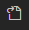

# Getting Started with Create React App

This project was bootstrapped with [Create React App](https://github.com/facebook/create-react-app).

## Available Scripts

In the project directory, you can run:

### `npm start`

Runs the app in the development mode.\
Open [http://localhost:3000](http://localhost:3000) to view it in your browser.

The page will reload when you make changes.\
You may also see any lint errors in the console.

### `npm test`

Launches the test runner in the interactive watch mode.\
See the section about [running tests](https://facebook.github.io/create-react-app/docs/running-tests) for more information.

### `npm run build`

Builds the app for production to the `build` folder.\
It correctly bundles React in production mode and optimizes the build for the best performance.

The build is minified and the filenames include the hashes.\
Your app is ready to be deployed!

See the section about [deployment](https://facebook.github.io/create-react-app/docs/deployment) for more information.

### `npm run eject`

**Note: this is a one-way operation. Once you `eject`, you can't go back!**

If you aren't satisfied with the build tool and configuration choices, you can `eject` at any time. This command will remove the single build dependency from your project.

Instead, it will copy all the configuration files and the transitive dependencies (webpack, Babel, ESLint, etc) right into your project so you have full control over them. All of the commands except `eject` will still work, but they will point to the copied scripts so you can tweak them. At this point you're on your own.

You don't have to ever use `eject`. The curated feature set is suitable for small and middle deployments, and you shouldn't feel obligated to use this feature. However we understand that this tool wouldn't be useful if you couldn't customize it when you are ready for it.

## Learn More

You can learn more in the [Create React App documentation](https://facebook.github.io/create-react-app/docs/getting-started).

To learn React, check out the [React documentation](https://reactjs.org/).

### Code Splitting

This section has moved here: [https://facebook.github.io/create-react-app/docs/code-splitting](https://facebook.github.io/create-react-app/docs/code-splitting)

### Analyzing the Bundle Size

This section has moved here: [https://facebook.github.io/create-react-app/docs/analyzing-the-bundle-size](https://facebook.github.io/create-react-app/docs/analyzing-the-bundle-size)

### Making a Progressive Web App

This section has moved here: [https://facebook.github.io/create-react-app/docs/making-a-progressive-web-app](https://facebook.github.io/create-react-app/docs/making-a-progressive-web-app)

### Advanced Configuration

This section has moved here: [https://facebook.github.io/create-react-app/docs/advanced-configuration](https://facebook.github.io/create-react-app/docs/advanced-configuration)

### Deployment

This section has moved here: [https://facebook.github.io/create-react-app/docs/deployment](https://facebook.github.io/create-react-app/docs/deployment)

### `npm run build` fails to minify

This section has moved here: [https://facebook.github.io/create-react-app/docs/troubleshooting#npm-run-build-fails-to-minify](https://facebook.github.io/create-react-app/docs/troubleshooting#npm-run-build-fails-to-minify)

## What is React ?
* React is a javascript library for building user interfaces, especially for web applications.
* React was created by Facebook to make it easier to build complex applications which are dynamic and   interaction.
* Before react managing updates and changes in web pages was complicated and slow. When using react, it makes this process faster and move efficient.
* It was created to simplify developer's life by easy creating, complex applications and sped up process and the performance of the pages.

## Key Features of React 
1. Jsx 
2. Virtual DOM
3. Component-based Architecture
4. One-way data flow

## Jsx - what is Jsx ?
* Jsx - it's a system extension for javascript that looks like html
* Jsx allows you to write html code in javascript files. It's really simplifies the process of creating interactive web pages. Make it more cleaner and readable.

## DOM - What is DOM ?
* DOM is a document object model. The DOM is needed to organize and access elements on a webpage
* It is a javascript object that contains all the elements you have in the html, like paragraph, links, lists and others.
* DOM is a tree representation which contains the all elements you have in an html.
* DOM allows you to use javascript to find, add, update and delete elements without reloading the page. 
* For Example : When you're choosing a date on a webiste or booking a hotel, it's important that the page responds immediately - without making you wait 3 to 5 seconds for a fullpage reload. The DOM allows javascript to update only part of the page instantly, which improves the user experience. However, if you try to update many elements at the same time, or perform alot of DOM operations quickly, the browser can become slow or laggy.This performance slowdown is one of the disadvantages of using the DOM directly.

## Virtual DOM :
* The Virtual DOM is a lightweight copy of the real DOM. It helps update web pages faster, because it groups changes together and reduces extra work
* Instead of updating the real DOM every time, React users a Virtual DOM to figure out what exactly changed. It then efficiently updates just that part of the real DOM - saving time and improving performance.
* When you make multiple changes, React groups them in the Virtual DOM first. It then compares the new Virtual DOM with the old one, finds the differences and updates only the changed elements in the real DOM - making everything faster and more efficient.

## Component - Based Architecture
* It's a way of building interfaces by breaking them down into small pieces called components, such as a button or a form.
* Modern web pages - especially with React or other frameworks use a component - based architecture which makes it easier to build and manage large applications.
* It builds your web page out of small, reusable building blocks called components. This keeps your code clean, organized and easier to scale as your application grows.
* For Exampe : Imagine we have the main component, banner component and product component. We have a piece of code for these components. When we put them together, they form a web page. They can have their own state and behaviour, and you can reuse them anywhere, making development faster, cleaner and easier.

## One-Way Data Flow
* It means that data goes only from parent to child components.
* One-way data flow is needed to keep data flow simple and easy to manage.
* Child components can't change the data directly. Instead they send events to the parent to request changes. This keeps the system organized and predictable, with the parents acting as the single source of truth for data.

## Installation :
* Install Visual Studio Code, Nodejs
* Open Visual Studio Code, open terminal -> new terminal
* To check if nodejs is installed successfully or not - Type `node -v` in the terminal
* To check if npm is installed successfully or not - Type `npm -v` in the terminal.
* For Visual Studio Code Settings :
* File -> Preferences -> Settings
*   - To see the json settings
* `npx create-react-app my-app`  - It creates a react application folder installs all needed dependencies, create some basic files we need. Here `my-app` - It is the project name.
* The packages installed are :
* react - It's a library.
* react DOM - It is needed to work with DOM at least for rendering react application.
* react script - It's package
